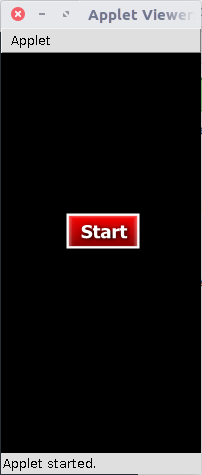
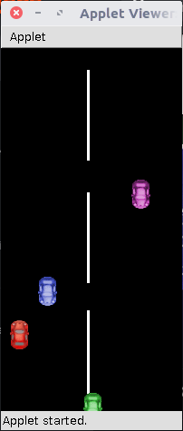
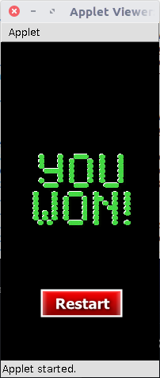
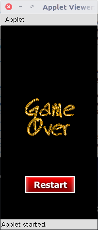

## Car Game Java Applet
### A simple car game developed using Java Applet and Java Multithreading. It has one player and three opponents which approach randomly at random speed.

* Technologies: Java, Multithreading, Graphics, Applet, HTML
* Tools: Geany
* Platform: Applet Viewer, Browser with Applet-Plugin
* Modules: Car, MyCar, Divider, PushButton
* Lines of Code: 365
* Month-Year: OCT-2010

### Screenshots

